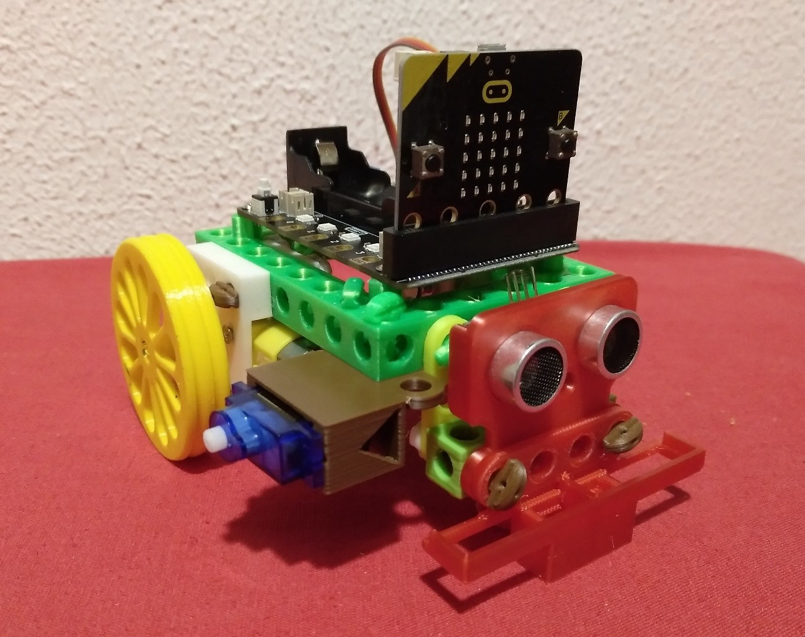
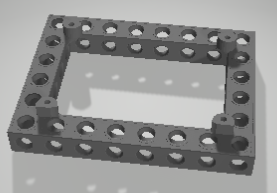
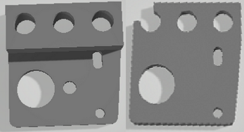

# PerotBot
Micro:bit robot

Electronics Stemfie es una llibreria STL de suports per tarjes de control, sensors i actuadors amb compatibilitat Stemfie, realitzada per [Jordi Mayné](https://github.com/maynej) des de Mechatronic Study 

Stemfie es un projecte de construcció lliure, que s'imprimeix en 3D (http://stemfie.org) 

Tota la [documentació es pot trobar en PDF](https://github.com/maynej/PerotBot/tree/main/Doc).

STL per imprimir (https://github.com/maynej/PerotBot).

## Suports 3D
  
Descripció         | Imatge          | Arxiu         
------------- | ------------- | ------------- 
Base Microbit | | [Base Arduino UNO](STL/MicrobitBaseStemfie.stl)
Sensor Ultra-Sons | | [Simetric](STL/USSymmetricSensor4V_STEMFIE.stl) , [Asimetric](STL/USAsymmetricSensor4V_STEMFIE.stl)
Suport MotorDC TT | | [MotorDC TT L1](STL/SuportMotorTTD1.stl), [MotorDC TT L2](STL/SuportMotorTTED1.stl), [MotorDC TT R1](STL/SuportMotorTTX2.stl), [MotorDC TT R2](STL/SuportMotorTTX2.stl)2
Sensor Línia Sensor | | [Sensor Línia](STL/LineSensor_mClonSTEMFIE.stl)
Roda 1 o Roda 2 |  | [Roda 1L](STL/Wheel_1L_PerotBotSTEMFIE.stl), [Roda 1R](STL/Wheel_1R_PerotBotSTEMFIE.stl), [Roda 2L](STL/Wheel_2L_PerotBotSTEMFIE.stl), [Roda 2R](STL/Wheel_2R_PerotBotSTEMFIE.stl)
Cargol BU02.00 | | [BU02.00](STL/ShoulderScrewRHDRHBU02.00-SPN-SSC-0048.stl)
Cargol BU01.75 | | [BU01.75](STL/ShoulderScrewRHDRHBU01.75-SPN-SSC-0047.stl)
Cargol BU01.50 | | [BU01.50](STL/ShoulderScrewRHDRHBU01.50-SPN-SSC-0046.stl)
Cargol BU01.25 | | [BU01.25](STL/ShoulderScrewRHDRHBU01.25-SPN-SSC-0045.stl)
Cargol BU01.00 | | [BU01.00](STL/ShoulderScrewRHDRHBU01.00-SPN-SSC-0044.stl)
Cargol BU00.75 | | [BU00.75](STL/ShoulderScrewRHD_RH_BU00.75-SPN-SSC-0043.stl)
Cargol BU00.50 | | [BU00.50](STL/ShoulderScrewRHD_RH_BU00.50-SPN-SSC-0042.stl)
Femella | | [Femella](STL/NutRHBU01.00x5mm-SPN-NUT-0001.stl)
Volandera | | [Volandera](STL/NutRHBU01.00x5mm-SPN-NUT-0001.stl)
Bloc 4 | | [Bloc 4](STL/beam1x1x4.stl)
Tensor 3 | | [Tensor 3](STL/BraceSTRERRBU03x01x00.25-SPN-BRC-0002.stl)

# Opcionals 
Descripció         | Imatge          | Arxiu
------------- | ------------- | ------------- 
Servomotor SG09 | | [Servo](STL/Servo3H_mClonSTEMFIE.stl) , [Adaptador SG9](STL/Servo9GAdapter_Stemfie.stl)
Suport Sensor Llum LDR (Light Sensor) | | [LDR L](STL/LDRSensorL_PerotBot.stl) , [LDR R](STL/LDRSensorR_PerotBot.stl)
Escaire | | [Escaire](STL/1L.stl)
Tensor 4 | | [Tensor 4](STL/BraceSTRERRBU04x01x00.25-SPN-BRC-0003.stl)

## Llicència

Attribution-ShareAlike 4.0 International (CC BY-SA 4.0)
